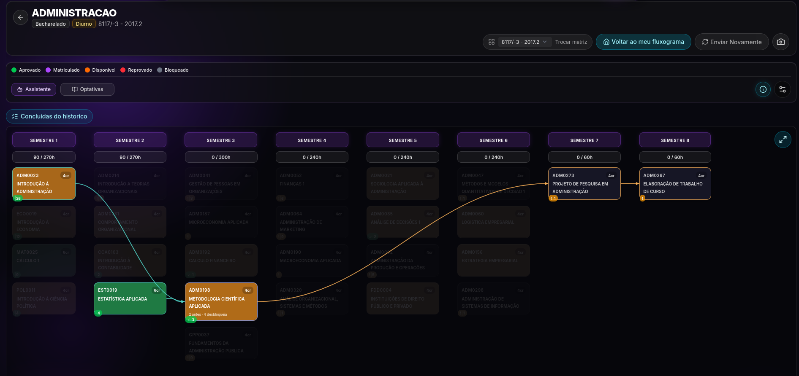
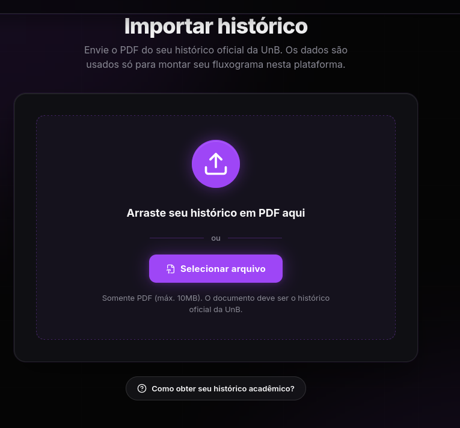
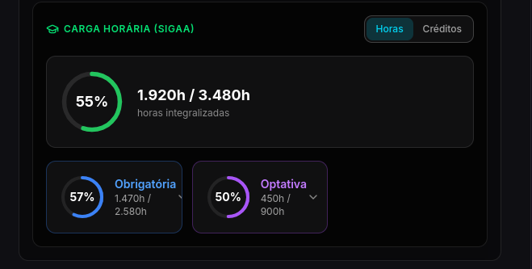

# 3. Características do Produto

## 3.1 Visão Geral do Produto

O **No Fluxo UNB** é uma aplicação web que visa ajudar os alunos a monitorar e montar a sua grade na Universidade de Brasília (UnB). O site tem várias funcionalidades importantes que fecha lacunas deixado pelos sistemas oficiais da UnB. Como um fluxograma interativo, estatísticas relevantes e uma IA que recomenda matérias para o usuário.

## 3.2 Identificação das características do produto

Abaixo estão, de forma sintética, as principais características do **No Fluxo UNB** consideradas nesta identificação do produto. As informações foram coletadas no repositório público [...](https://github.com/unb-mds/2025-1-NoFluxoUNB).

    
<strong>Tabela 1 - Características do Produto</strong>

| Característica                                   | Descrição                                                               |
| ------------------------------------------------ | ----------------------------------------------------------------------- |
| **Nome**                                         | No Fluxo UNB                                                      |
| **Versão**                                       |    2.3.0                                                                   |
| **Público-alvo**                                 |  Estudantes da Universidade de Brasília|
| **Plataformas**                                  | web                                 |
| **Banco de dados**                               |  postgresSQL usando supabase                                                |
| **Tecnologias Frontend (web)**                   |   SvelteKit 2 + Svelte 5, Tailwind CSS 4, Vite 7|
| **PDF Processing**                               | 	Python (PyMuPDF + Tesseract OCR)|
| **Tecnologias Backend (API)**                    | Node.js, TypeScript,Express.js Docker                                                 |
| **Conhecimento exigido em informática**          |  baixo (design intuitivo e explicações para usuário)|
| **Conhecimento exigido no domínio da aplicação** | baixo (aplicação simples com funcionalidades bem fáceis de entender) |

<b>Fonte: <a href="https://github.com/unb-mds/2025-1-NoFluxoUNB">código-fonte</a> <a href="https://github.com/unb-mds/2025-1-NoFluxoUNB/blob/main/docs/PROJECT_DOCUMENTATION.md#5-database">documentação-técnica</a></b>Autores; Pedro-Cruz

## 3.3 Módulos e Componentes do Produto

A seguir apresentamos, em alto nível, os principais módulos e funcionalidades do **No Fluxo UNB**. Cada subseção apresenta o objetivo do módulo, seu funcionamento básico e observações úteis para a avaliação.

### 3.3.1 Fluxograma interativo do currículo com visualização de pré-requisitos

Permite ao aluno visualizar a grade curricular de forma interativa, exibindo as disciplinas e suas dependências de pré-requisitos. O fluxograma é bem interessante e é uma das funcionalidades mais interessantes.

<b>Fonte: Captura de tela em <a href="https://no-fluxo.crianex.com/">site-live</a></b>

### 3.3.2 Extração de histórico escolar em PDF (no navegador + fallback com OCR)

Realiza a leitura automática de históricos escolares em formato PDF diretamente no navegador do usuário. Existe também um guia passo a passo para os alunos que não souberem como emitir o histórico no sigaa. Em seguida ele compara com o fluxo oficial e modifica o fluxograma interativo mostrando quais matérias o alunos realizou ou não.

<b>Fonte: Captura de tela em <a href="https://no-fluxo.crianex.com/">site-live</a></b>

### 3.3.3 Recomendações de disciplinas com IA (via RAGFlow)

Utiliza inteligência artificial integrada ao RAGFlow para sugerir disciplinas dado um texto. As recomendações buscam otimizar o planejamento semestral e reduzir conflitos acadêmicos.

<b>Fonte: Captura de tela em <a href="https://no-fluxo.crianex.com/">site-live</a></b>

### 3.3.4 Autenticação com Google OAuth, email/senha e acesso anônimo

Disponibiliza múltiplas formas de autenticação, incluindo login com conta Google, cadastro tradicional com email e senha, além de acesso anônimo para usuários que desejam explorar funcionalidades básicas sem criar conta.

<b>Fonte: Captura de tela em <a href="https://no-fluxo.crianex.com/">site-live</a></b>

### 3.3.5 Rastreamento de progresso com cálculo de horas obrigatórias e optativas

Monitora o progresso acadêmico do aluno calculando automaticamente as horas concluídas em disciplinas obrigatórias e optativas. O sistema apresenta indicadores visuais de avanço no curso e informa pendências necessárias para a conclusão da graduação.

<b>Fonte: Captura de tela em <a href="https://no-fluxo.crianex.com/">site-live</a></b>

---

## Referências Bibliográficas
> NO FLUXO UNB. **Código-fonte**. Disponível em: <https://github.com/unb-mds/2025-1-NoFluxoUNB>. Acesso em: 13 maio 2026.

> NO FLUXO UNB. **Documentação Técnica**. Disponível em: <https://github.com/unb-mds/2025-1-NoFluxoUNB/blob/main/docs/PROJECT_DOCUMENTATION.md#5-database>. Acesso em: 13 maio 2026.

> NO FLUXO UNB. **Site Oficial**. Disponível em: <https://no-fluxo.crianex.com/>. Acesso em: 13 maio 2026.

---

## Histórico de Versões

| Versão | Descrição                      | Autor(es)                                          | Data de Produção |
| :----: | ------------------------------ | -------------------------------------------------- | :--------------: |
| 1.0 | adicionar descrição e principais módulos do produto | Pedro Cruz | 13/05/2026 |
