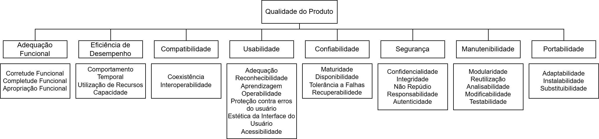

# 4. Especificação do modelo de qualidade

## 4.1 Introdução

O modelo de qualidade adotado nesta avaliação tem como base a norma **ISO/IEC 25010:2011** (SQuaRE), que define oito características de qualidade de produto de software. O modelo padrão foi analisado e **adaptado** ao contexto específico do **No Fluxo UnB**, considerando três fatores determinantes:

- **Perfil dos stakeholders**: estudantes da UnB como usuários principais e desenvolvedores voluntários que se revezam a cada semestre letivo como mantenedores;
- **Cenário crítico de uso**: pico de acessos simultâneos nos dias anteriores ao período de matrícula no SIGAA, quando falhas comprometem diretamente o planejamento acadêmico dos alunos;
- **Modelo de manutenção**: projeto de código aberto mantido por equipes estudantis rotativas, o que exige que a base de código seja compreensível e modificável por novos integrantes a cada semestre.

Diante dessas condições, **duas características** foram priorizadas como foco central desta avaliação: **Confiabilidade** e **Manutenibilidade**. As demais características do modelo ISO/IEC 25010 foram igualmente analisadas, recebendo ênfases menores conforme justificado na Seção 1.4 do Propósito da Avaliação, e não compõem o escopo principal desta avaliação.

---

## 4.2 Modelo de Qualidade

O modelo de qualidade do produto é dividido em oito características: adequação funcional, eficiência de desempenho, compatibilidade, usabilidade, confiabilidade, segurança, manutenção e portabilidade.

A **Tabela 1** abaixo aprensenta a descrição de cada característica do modelo de qualidade do produto, de acordo com a ISO/IEC 25010:

    
<strong>Tabela 1 – Características de Qualidade</strong>

| Característica               | Descrição                                                                                                                                                                     |
| ---------------------------- | ----------------------------------------------------------------------------------------------------------------------------------------------------------------------------- |
|  **Adequação Funcional**      | Grau em que o produto fornece funções que atendem às necessidades declaradas e implícitas quando usado sob condições especificadas.                                           |
|  **Eficiência de Desempenho** | Desempenho relativo à quantidade de recursos usados sob condições estabelecidas.                                                                                              |
|  **Compatibilidade**          | Grau em que um produto, sistema ou componente pode trocar informações com outros e/ou desempenhar suas funções enquanto compartilha o mesmo ambiente de hardware ou software. |
|  **Usabilidade**              | Grau em que um produto pode ser usado por usuários especificados para atingir metas especificadas com eficácia, eficiência e satisfação.                                      |
|  **Confiabilidade**           | Grau em que um sistema, produto ou componente desempenha funções especificadas sob condições especificadas por um período de tempo especificado.                              |
|  **Segurança**               | Grau em que o produto protege informações e dados para que pessoas, sistemas ou outros produtos tenham o grau de acesso apropriado a seus tipos e níveis de autorização.      |
|  **Manutenibilidade**         | Grau de eficácia e eficiência com que um produto pode ser modificado pelos mantenedores.                                                                                      |
|  **Portabilidade**            | Grau de eficácia e eficiência com que um sistema pode ser transferido de um ambiente de hardware, software ou outro ambiente operacional para outro.                          |

    Fonte: Tradução nossa de ISO/IEC 25010:2011, p. 10–16.

A **Figura 1** abaixo apresenta o modelo de qualidade do produto, com suas características e subcaracterísticas.

    
<strong>Figura 1 – Modelo de Qualidade do Produto</strong>

    
    
<i>Fonte: Adaptado de ISO/IEC, 2011, p. 4.</i>

## 4.3 Características de Qualidade

Considerando o modelo apresentado e as [necessidades das partes interessadas](partes-interessadas.md#22-mapeamento-das-partes-interessadas-stakeholders), a equipe decidiu analisar o produto de software com base nas seguintes características: **Confiabilidade** e **Manutenibilidade**. A escolha foi guiada pelo cenário crítico de uso (período de matrícula) e pelo perfil da equipe de desenvolvimento (rotativa, voluntária, open-source).

---

### 4.3.1 Confiabilidade

**Definição (ISO/IEC 25010):** Grau em que um sistema executa funções especificadas sob condições definidas durante um período determinado, sem apresentar falhas.

**Justificativa da seleção:** O No Fluxo UnB é acessado intensamente nos dias anteriores ao período de matrícula no SIGAA. Nesse cenário, qualquer falha — travamento, perda de dados do histórico carregado, ou indisponibilidade do servidor — prejudica diretamente o planejamento acadêmico dos estudantes. Além disso, o backend em Python realiza operações complexas de leitura e mesclagem de fluxogramas, sujeitas a exceções não tratadas. As subcaracterísticas priorizadas dentro de Confiabilidade são **Maturidade** e **Disponibilidade** — por impacto imediato no cenário de matrícula — seguidas de **Tolerância a Falhas** e **Recuperabilidade**, relevantes para garantir que falhas eventuais não comprometam os dados do usuário. **Stakeholder diretamente afetado: estudantes da UnB.**

---

### 4.3.2 Manutenibilidade

**Definição (ISO/IEC 25010):** Grau de eficácia e eficiência com que um produto pode ser modificado pelos mantenedores.

**Justificativa da seleção:** O No Fluxo UnB é um projeto de código aberto mantido por equipes estudantis rotativas, onde os integrantes se revezam a cada semestre letivo. Esse contexto exige que novos desenvolvedores consigam compreender, diagnosticar e modificar o código rapidamente, sem depender de documentação exaustiva ou do conhecimento de quem o desenvolveu. As subcaracterísticas mais críticas nesse cenário são **Modularidade**, **Analisabilidade** e **Modificabilidade** — sem elas, um integrante novo não consegue trabalhar com segurança — seguidas de **Testabilidade**, que fornece a rede de segurança para alterações, e **Reusabilidade**, de menor urgência dado o estágio atual do projeto. **Stakeholders diretamente afetados: desenvolvedores e mantenedores do No Fluxo UnB (equipe rotativa de MDS/FGA-UnB).**

---

## Referências Bibliográficas

> INTERNATIONAL ORGANIZATION FOR STANDARDIZATION. ISO/IEC 25010:2011. Systems and software engineering — Systems and software Quality Requirements and Evaluation (SQuaRE) — System and software quality models. Genebra: ISO, 2011.

---

## Histórico de Versões

| Versão | Descrição                      | Autor(es)                                                  | Data de Produção |
| :----: | ------------------------------ | ---------------------------------------------------------- | :--------------: |
| `1.0`  | Criação do documento           | [André Meyer](https://github.com/Andremeyerr)         |    13/05/2026    |