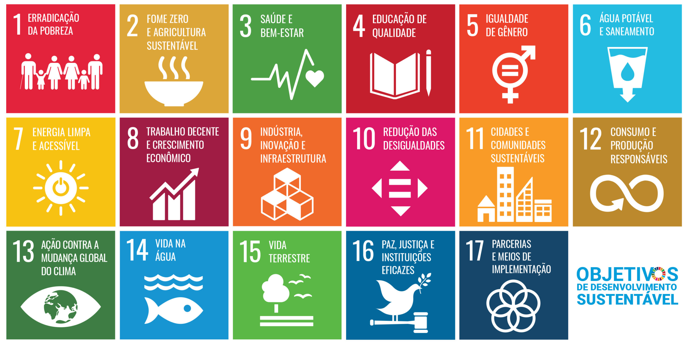

# 6. Objetivos de Desenvolvimento Sustentável Relacionados

As metas de desenvolvimento sustentável da ONU (ODS) foram criadas
em 2015 na Agenda de Desenvolvimento 2030. Nela, os países membros 
da Organização das Nações Unidas (ONU) criaram uma série de metas 
para guiar as ações dos governos, empresas e Organizações não Governamentais(OnGs)
para um objetivo em comum. 

  

  Fonte: <a href="https://brasil.un.org/pt-br/sdgs" target="_blank">ONU Brasil — Objetivos de Desenvolvimento Sustentável</a>

Analisando a natureza do serviço prestado pelo No Fluxo UNB, selecionamos as ODS que melhor refletem o seu objetivo. Abaixo, encontram-se as ODS destacadas e suas principais conexões com o projeto:

## 6.1 ODS selecionados para o Guardiões da Saúde

### [ODS 4 — Educação de Qualidade](https://brasil.un.org/pt-br/sdgs/4)

-   **Justificativa**: A ligação é evidente, já que a principal funcionalidade do projeto é ajudar
alunos da Universidade de Brasília a se manterem dentro do fluxo. Portanto,
pode ser uma importante ferramenta para a garantia da permanência dos alunos 
na universidade pública.
-   **Conexões principais**:
A funcionalidade [fluxograma-Interativo](./caracteristicas-produto.md#331-fluxograma-interativo-do-currículo-com-visualização-de-pré-requisitos) é a principal funcionalidade do site. Ela ajuda os alunos a se organizarem, e terem mais consiencia da sua situação acadêmica. 

 Na mesma linha as [estatísticas](./caracteristicas-produto.md#335-Rastreamento-de-progresso-com-cálculo-de-horas-obrigatórias-e-optativas) informam o aluno e ajuda ele a fazer decisões melhores sobre seu semetre e como criar sua grade horária.
    

### [ODS 9 — Indústria, Inovação e Infraestrutura](https://brasil.un.org/pt-br/sdgs/9)

-   **Justificativa**: O no
fluxo se destaca de forma inovadora, uma vez que automatiza 
processos originalmente feitos à mão. 
Esse recurso passa a ser um facilitador para os alunos, que dependem de um 
sistema pouco intuitivo. E também integra novas tecnologias para a cotidiano dos alunos
com o uso de IA para recomendação de tecnologias.

O projeto continua em desenvolvimento em outras disciplinas como nesta de
qualidade de software e em Teste de software. O site tem grande potencial 
para ser uma infraestrutura resiliente e se consolidar como parte importante na vida acadêmica 
dos estudantes da Universidade de Brasilia.

-   **Conexões principais**:
O site no-fluxo lança várias inovações para seu usuário, o [fluxograma-Interativo](./caracteristicas-produto.md#331-fluxograma-interativo-do-currículo-com-visualização-de-pré-requisitos) é uma grande melhora ao sistema oficial

Também integra novas tecnologias à vida dos alunos com a [IA-de-recomendação-de-matérias](./caracteristicas-produto.md#333-Recomendações-de-disciplinas-com-IA-(via-RAGFlow)).

---

## Referências Bibliográficas
> NO FLUXO UNB. **Documentação Técnica**. Disponível em: <https://github.com/unb-mds/2025-1-NoFluxoUNB/blob/main/docs/PROJECT_DOCUMENTATION.md#5-database>. Acesso em: 13 maio 2026.

> NO FLUXO UNB. **Site Oficial**. Disponível em: <https://no-fluxo.crianex.com/>. Acesso em: 13 maio 2026.
> GT AGENDA 2030. **ODS 4 – Educação de Qualidade**. Disponível em: <https://gtagenda2030.org.br/ods/ods4/>. Acesso em: 13 maio 2026.
> GT AGENDA 2030. **ODS 9 – Indústria, Inovação e Infraestrutura**. Disponível em: <https://gtagenda2030.org.br/ods/ods9/>. Acesso em: 13 maio 2026.

---

## Histórico de Versões

| Versão | Descrição                      | Autor(es)                                          | Data de Produção |
| :----: | ------------------------------ | -------------------------------------------------- | :--------------: |
| 1.0 | escreveu as justificativas e o texto de introdução | Pedro Cruz  | 12/05/2026 |
