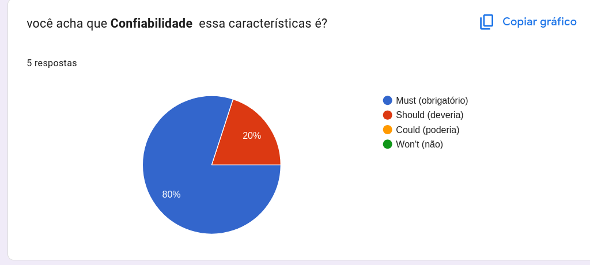
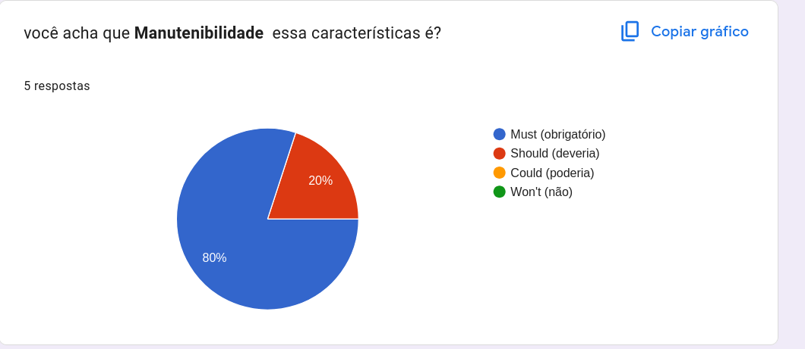
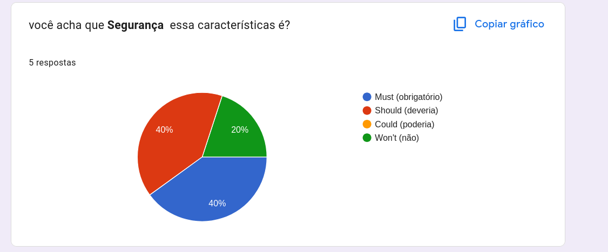
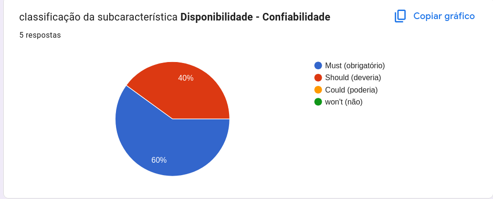
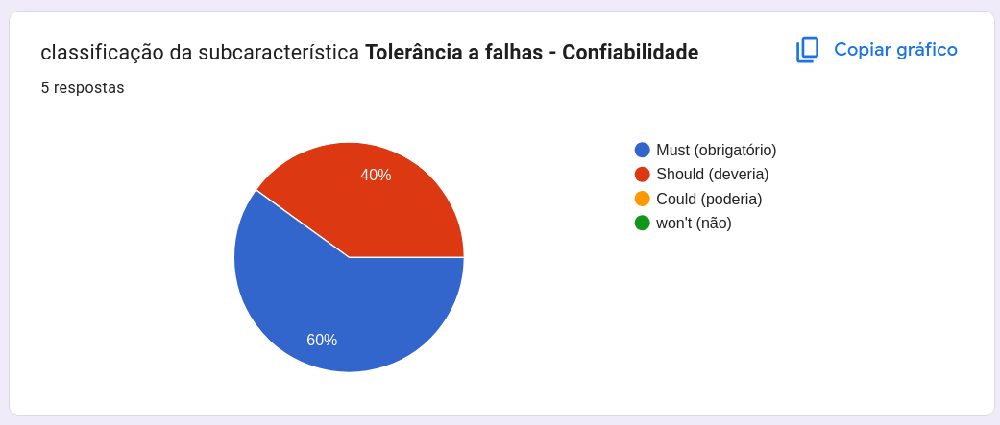
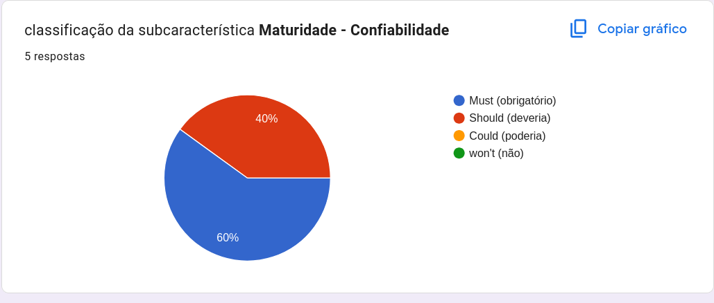
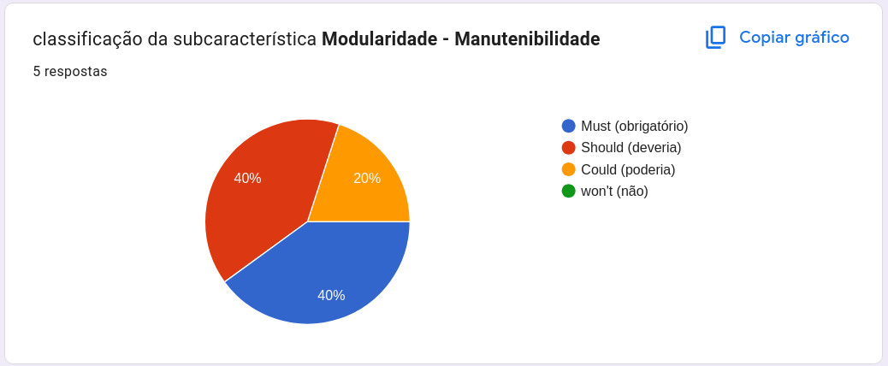
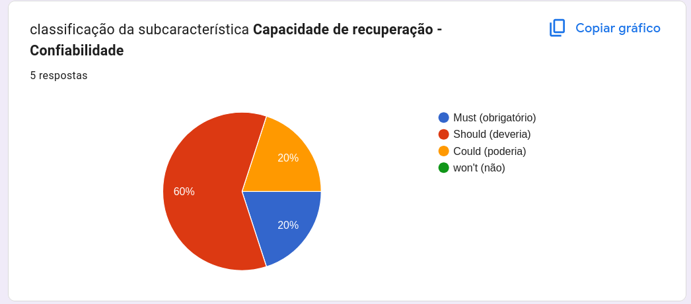
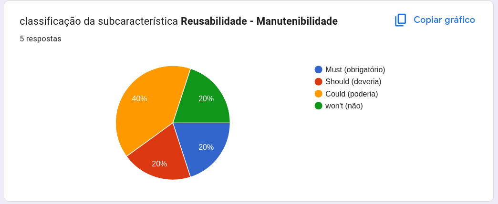
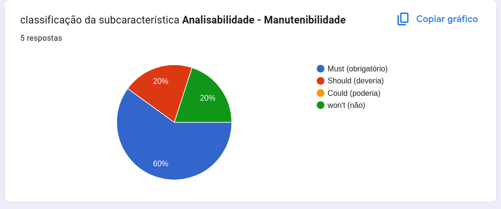

# 5. Seleção das características avaliadas

## 5.1 Critérios de Priorização
Para priorização foi feito um Moscow assíncronamente e uma discussão sobre os resultado do MosCow. O resultado do moscow foi:

Como demonstrado a preferência do grupo foi para confiabilidade e manutenabilidade. Foi concordado que essas características são importantes porque como é um site muito novo e feito por estudantes em formação, e não profissionais formados, uma análise mais profunda da confiabilidade e da manutenabilidade são de extrema importancia. Apesar de não poder falar com certeza, ao analisar o código fonte nosso grupo suspeita de uso de IA para criação de certas partes do código, principalmente nos documentos de infraestrutura. Pelo uso de Icones e vários comentários na documentação e nos documentos .docker.

Decidimos não priorizar a segurança porque o site não lida com informações sensíveis dos alunos. Apesar do histórico acadêmico não ser um documento público, ele é compartilhado livremente entre alunos, professores e empregadores. O vazamento desses dados não mostra um grande risco para o usuário. Então concordamos em manter o resultado do moscow e priorizar Confiabilidade e Manutenabilidade. 

---

## 5.2 Priorização das Subcaracterísticas
Para priorização da Características foi feito um formulário eletrônico e uma discussão para confirmar os resultados.

Em confiabilidade, as subcaracterísticas mais votadas foram Maturidade, Disponibilidade e Tolerância a Falhas. Após discussão, o grupo concordou que essas eram, de fato, as mais importantes para análise. A Capacidade de Recuperação foi considerada, porém decidiu-se que ela não entraria no escopo do projeto.

Em manutenibilidade, as subcaracterísticas mais votadas foram Analisabilidade, Modificabilidade, Testabilidade e Modularidade. Durante as discussões, o grupo concordou que essas seriam as subcaracterísticas analisadas. Além disso, foi destacado que a avaliação desses aspectos era especialmente importante, considerando que o projeto foi desenvolvido por alunos em formação, o que aumenta a possibilidade de essas subcaracterísticas não terem sido plenamente consideradas durante o desenvolvimento.

## Referências Bibliográficas

---

## Histórico de Versões

| Versão | Data       | Descrição                                      | Autor(es)                                           |
| ------ | ---------- | ---------------------------------------------- | --------------------------------------------------- |
| 1.0 | 13/05/2026 | adicionou o moscow das características e subcaracteristicas e suas justificativas | Pedro Cruz |

