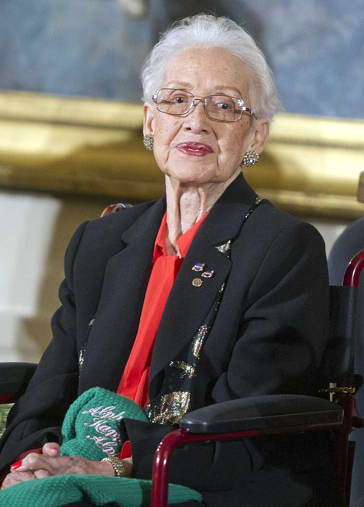

# Katherine Johnson

  

  Fonte: <a href="https://people.com/human-interest/katherine-johnson-dies-at-101/" target="_blank">Katherine Johnson</a>

## Quem foi Katherine Johnson

**Katherine Johnson (1918–2020)** foi uma matemática, física e cientista norte-americana reconhecida por suas contribuições fundamentais para a exploração espacial dos Estados Unidos durante sua atuação na NASA. Seu trabalho teve papel decisivo no cálculo de trajetórias, janelas de lançamento e rotas orbitais utilizadas em algumas das missões mais importantes da corrida espacial.

Entre suas contribuições mais conhecidas está a verificação manual dos cálculos do voo **Mercury-Atlas 6** (1962), missão que levou o astronauta John Glenn à órbita da Terra. Além disso, Katherine Johnson participou de estudos e cálculos relacionados aos programas **Apollo 11** e **Apollo 13**, contribuindo para avanços significativos da engenharia aeroespacial.

Ao longo de sua trajetória, tornou-se símbolo de excelência científica, precisão matemática e superação de barreiras sociais e raciais em um contexto historicamente marcado pela desigualdade de gênero e discriminação racial. Em reconhecimento à relevância de seu trabalho, recebeu em 2015 a **Presidential Medal of Freedom**, uma das maiores honrarias civis dos Estados Unidos.

---

## Referências

1. NASA. *Katherine Johnson Biography*. Disponível em: <https://www.nasa.gov/people/katherine-johnson/>. Acesso em: 13 maio 2026.

2. NATIONAL WOMEN'S HISTORY MUSEUM. *Katherine Johnson*. Disponível em: <https://www.womenshistory.org/education-resources/biographies/katherine-johnson>. Acesso em: 13 maio 2026.

3. BRITANNICA. *Katherine Johnson | American mathematician*. Disponível em: <https://www.britannica.com/biography/Katherine-Johnson>. Acesso em: 13 maio 2026.

## Histórico de Versões

| Versão | Descrição                      | Autor(es)                                                  | Data de Produção |
| :----: | ------------------------------ | ---------------------------------------------------------- | :--------------: |
| `1.0`  | Criação do documento           | [Giovanni Dornelas](https://github.com/GGdornelas)         |    13/05/2026    |